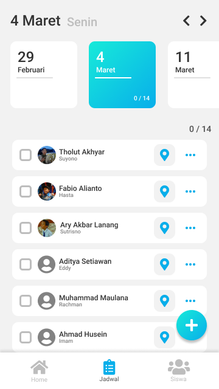

# Project Kunjungan Guru Wali

Project Sekolah - Kunjungan Guru Wali

## Main Purpose

Teachers job to visit all their student is a must in SMK PGRI 3 Malang and it's not an easy job. Without proper documentation, the teachers can get lost or be in a danger.

But with this app, it's now a lot easier to visit each student. Start from making the schedule for several students for each day, done visiting? Just check the student in the schedule and you're good to go to the next student.
If teachers have some trouble visiting the student, there's a map feature by using google navigation API from the teacher current position to the student address. Or just call their parent number by pressing one button. It's that easy...
